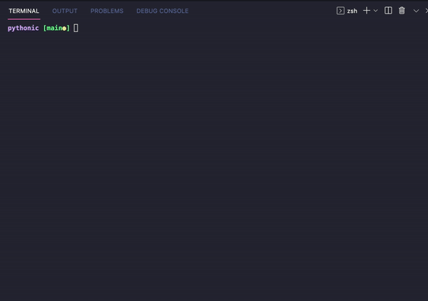
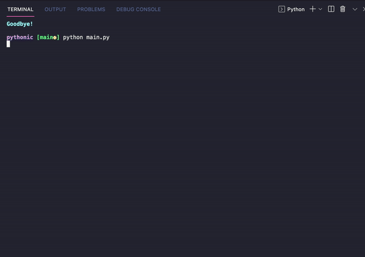
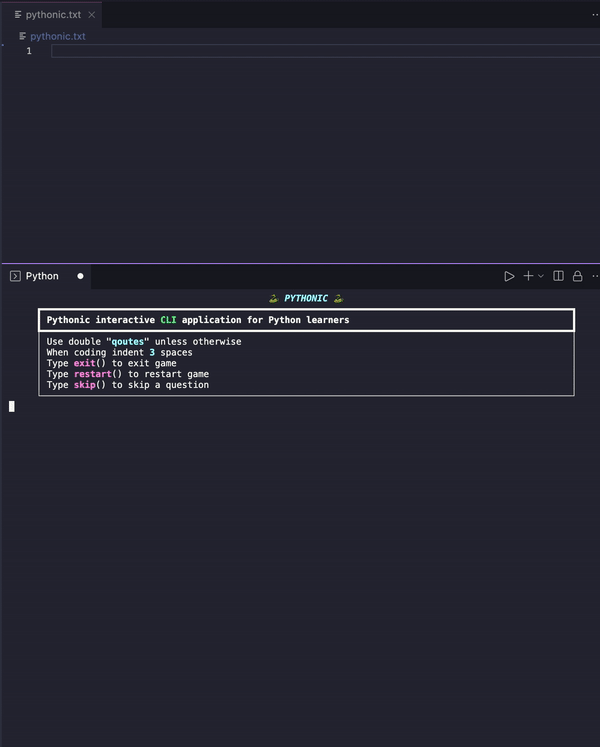

# ***🐍 Pythonic***

## **An interactive CLI application for python learners**

Answer random interactive python questions via the terminal and get prompted if 👍 correct or 💩 incorrect. One point gets added users total score if correct. An, incorrect answer creates a prompt displaying the correct answer. In addition, correct answers are written to a txt file for later review.

### **Run: python3 main.py to start the application**

    ====================== Instructions ======================
   
    ▫ console.print('- Use double "qoutes" unless otherwise
    ▫ When coding indent 3 spaces
    ▫ Type exit() to exit game
    ▫ Type restart() to restart game
    ▫ Type skip() to skip a question

### **PROMPTS: help keep you on your toes...**

### **CODING: interactive coding challenges...**

### **STUDY: future studies for interviews... maybe not**
